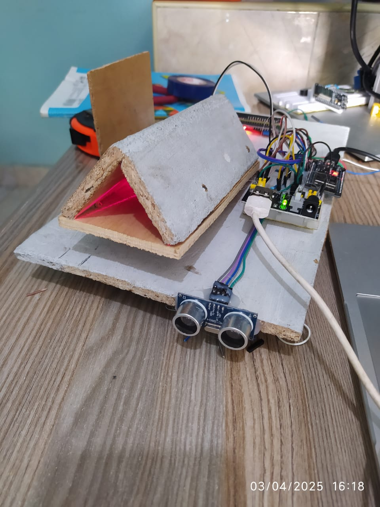
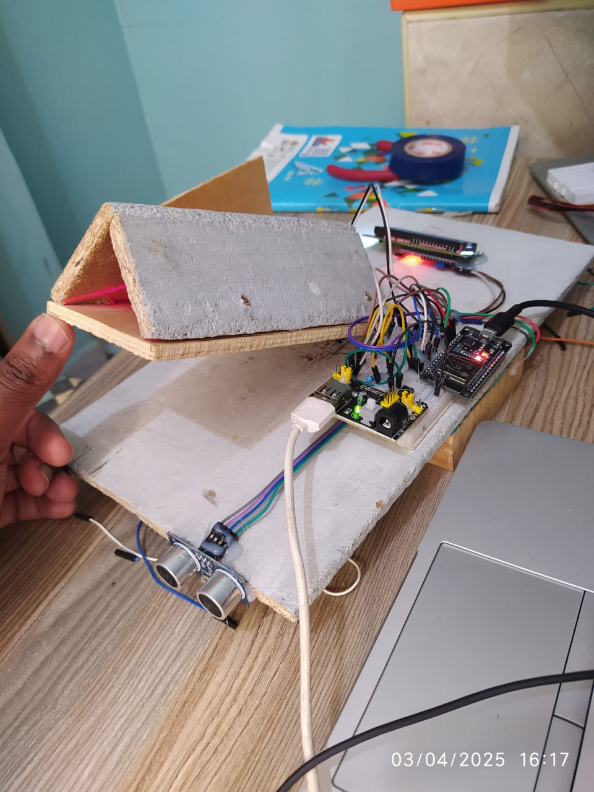
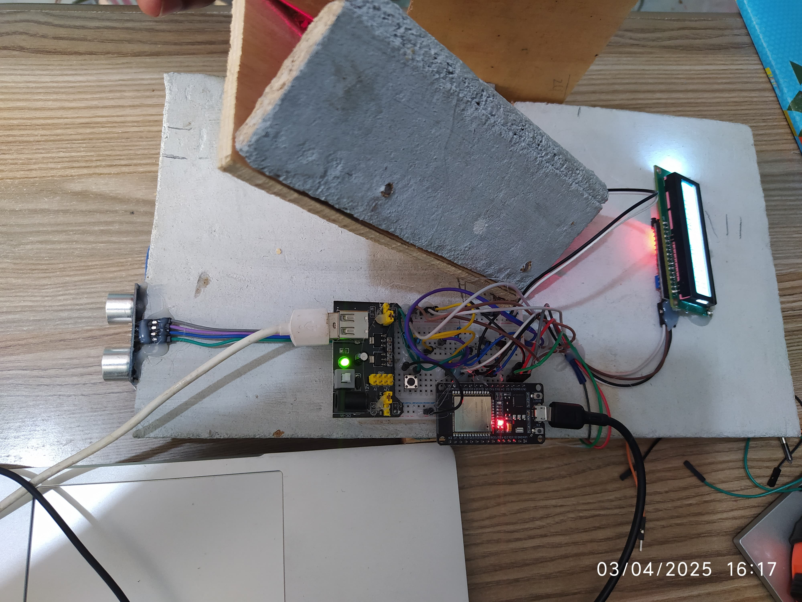
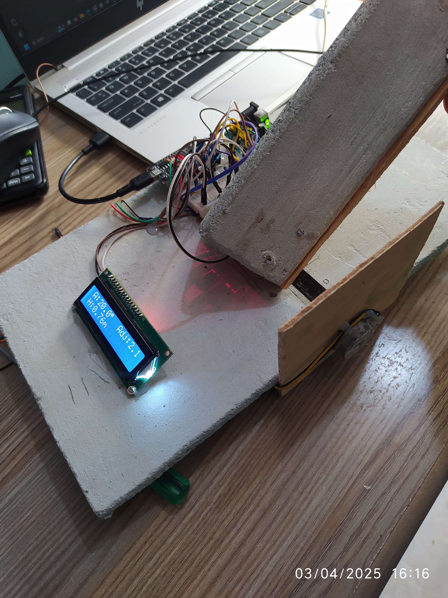

Hybrid Dimensioning Tool – Smart Field Measurement System
A professional-grade measurement device combining ultrasonic, angular, and laser technologies for accurate field calculations in construction, surveying, civil engineering, and industrial applications while making record keeping Simple and accurate.

pppppp
Key Features
🔹 Triple-Sensor Technology: Combines ultrasonic distance measurement (0.02m–4m), angle detection (0°–90°), and laser targeting. - 
🔹 Real-Time Calculations: Computes vertical heights, spans, and object dimensions using trigonometric models. 
🔹 Cloud Integration: Automatically logs field data into Google Sheets for easy digital record keeping. 
🔹 Rugged Design: Battery-powered for portability and durable performance in harsh outdoor conditions.

Technical Specifications

Parameter	Specification
Angle Range	0° to 90° (±0.5° accuracy)
Distance Range	0.02 m to 4 m (±3 mm accuracy)
Power Supply	Rechargeable LiPo Battery (8+ hours continuous use)
Connectivity	Expandable to WiFi/Bluetooth (future versions)

Applications
Construction site layout and structural dimensioning
Civil engineering surveys (bridges, slopes, buildings)
Land surveying and topographic mapping
Industrial plant measurements (pipes, tanks, towers)
Agricultural planning (silos, greenhouses, terrain elevation)

Getting Started
1. Hardware Setup: Connect ultrasonic sensor, potentiometer, and laser module to ESP32 microcontroller.
2. Upload Firmware: Flash the provided Arduino/ESP32 sketch (to be added soon).
3. Calibration: Perform angle and distance calibration for accurate measurements. 
4. Field Operation: Point laser at target and press the measurement button. 
5. Data Logging: View results on LCD screen or automatically record to Google Sheets.

   

Documentation
(Coming Soon)

📄 Technical Manual (docs/technical_manual.md)

📄 Google Sheets Setup Guide (docs/data_logging.md)

📄 Calibration Procedure (docs/calibration.md)

License
This project is licensed under the MIT License — see the LICENSE file for details.

Developed and Maintained by Ephraim Mwangi — [2025]
